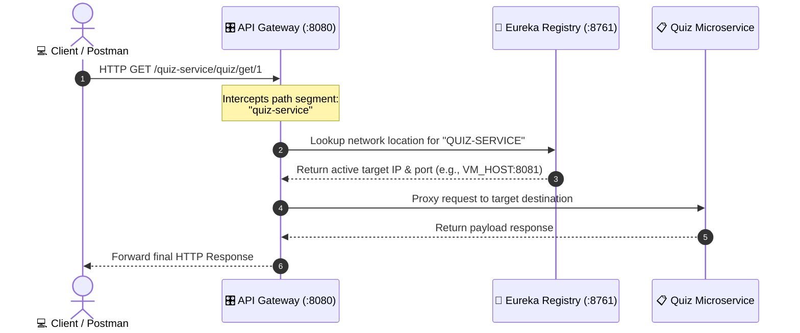

# 🎛️ API Gateway Service (Spring Cloud Gateway)

Welcome to the **API Gateway Service**. This project serves as the unified edge router and single entry point for our entire microservices ecosystem. It abstracts our underlying backend services behind a single network address, eliminating the need for clients to interact with individual service ports directly.

---

## 🧭 The Core Problem Solved by an API Gateway

In a standard microservice ecosystem, every service runs on its own standalone network port (e.g., Quiz on `8081`, Questions on `8082`). Forcing a frontend client or mobile app to manage these different host addresses introduces massive challenges:

1. **Brittle Client Mappings:** If a service changes its host port or scales dynamically, the frontend application breaks.
2. **Security & Cross-Cutting Tensions:** Implementing Auth, rate limiting, and request logging inside *every single service* leads to widespread code duplication.

### The Edge Router Paradigm
By placing this API Gateway at the perimeter on port `8080` (or `8765` in local debugging environments), clients talk exclusively to this gateway. The gateway intercepts the requests, queries our Eureka service registry, and handles proxy routing seamlessly behind the scenes.

---

## 🛠️ Configuration Blueprints (`application.properties`)

To transform a standard Spring Boot app into a dynamic locator gateway, the following core environment properties are mapped:

```properties
spring.application.name=api-gateway
server.port=8080

# Connect to the central phonebook (Eureka)
eureka.client.service-url.defaultZone=http://eureka-server-01:8761/eureka/
eureka.instance.prefer-ip-address=true

# 🚀 Dynamic Path Routing Configurations
spring.cloud.gateway.discovery.locator.enabled=true
spring.cloud.gateway.discovery.locator.lower-case-service-id=true
```

## 🧠 Understanding the Properties
- `discovery.locator.enabled=true` Tells the gateway to dynamically generate route maps by scanning service names inside the Eureka registry instead of requiring manual, hardcoded path specifications.
- `discovery.locator.lower-case-service-id=true` By default, Eureka registers service identifiers in uppercase blocks (e.g., `http://localhost:8080/QUIZ-SERVICE/quiz/create`). Enabling this converts incoming paths to clean lowercase formatting (e.g., `http://localhost:8080/quiz-service/quiz/create`).

## 📉 Request Lifecycle & Data Flow
When a client hits the gateway, the routing orchestration flows as follows:




## 📦 Cluster Target Port Index

| Service Module Name | Default Internal Port | Proxy Endpoint Route Mapping via Gateway |
| :--- | :---: | :--- |
| **`service-registry`** | `8761` | *Standalone Registry Dashboard Core* |
| **`api-gateway`** | `8080` | `http://localhost:8080/` *(Central Entry Point)* |
| **`quiz-service`** | `8080` | `http://localhost:8080/quiz-service/**` |
| **`question-service`** | `8080` | `http://localhost:8080/question-service/**` |