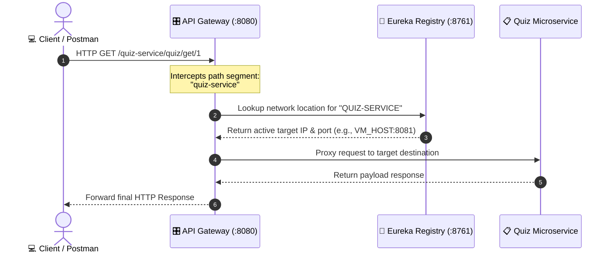

# 🎛️ API Gateway Service (Spring Cloud Gateway)

Welcome to the **API Gateway Service**. This project serves as the unified edge router and single entry point for our entire microservices ecosystem. It abstracts our underlying backend services behind a single network address, eliminating the need for clients to interact with individual service ports directly.

---

## 🧭 The Core Problem Solved by an API Gateway

In a standard microservice ecosystem, every service runs on its own standalone network port (e.g., Quiz on `8081`, Questions on `8082`). Forcing a frontend client or mobile app to manage these different host addresses introduces massive challenges:

1. **Brittle Client Mappings:** If a service changes its host port or scales dynamically, the frontend application breaks.
2. **Security & Cross-Cutting Tensions:** Implementing Auth, rate limiting, and request logging inside *every single service* leads to widespread code duplication.

### The Edge Router Paradigm
By placing this API Gateway at the perimeter on port `8080` (or `8765` in local debugging environments), clients talk exclusively to this gateway. The gateway intercepts the requests, queries our Eureka service registry, and handles proxy routing seamlessly behind the scenes.

---

## 🛠️ Configuration Blueprints (`application.properties`)

To transform a standard Spring Boot app into a dynamic locator gateway, the following core environment properties are mapped:

```properties
spring.application.name=api-gateway
server.port=8080

# Connect to the central phonebook (Eureka)
eureka.client.service-url.defaultZone=http://eureka-server-01:8761/eureka/
eureka.instance.prefer-ip-address=true

# 🚀 Dynamic Path Routing Configurations
spring.cloud.gateway.discovery.locator.enabled=true
spring.cloud.gateway.discovery.locator.lower-case-service-id=true
```

## 🧠 Understanding the Properties
- `discovery.locator.enabled=true` Tells the gateway to dynamically generate route maps by scanning service names inside the Eureka registry instead of requiring manual, hardcoded path specifications.
- `discovery.locator.lower-case-service-id=true` By default, Eureka registers service identifiers in uppercase blocks (e.g., `http://localhost:8080/QUIZ-SERVICE/quiz/create`). Enabling this converts incoming paths to clean lowercase formatting (e.g., `http://localhost:8080/quiz-service/quiz/create`).

## 📉 Request Lifecycle & Data Flow
When a client hits the gateway, the routing orchestration flows as follows:


```mermaid
sequenceDiagram
    autonumber
    actor Client as 💻 Client / Postman
    participant GW as 🎛️ API Gateway (:8080)
    participant Registry as 🏰 Eureka Registry (:8761)
    participant QuizMS as 📋 Quiz Microservice

    Client->>GW: HTTP GET /quiz-service/quiz/get/1
    Note over GW: Intercepts path segment:<br> "quiz-service"
    GW->>Registry: Lookup network location for "QUIZ-SERVICE"
    Registry-->>GW: Return active target IP & port (e.g., VM_HOST:8081)
    GW->>QuizMS: Proxy request to target destination
    QuizMS-->>GW: Return payload response
    GW-->>Client: Forward final HTTP Response
```


## 📦 Cluster Target Port Index

| Service Module Name | Default Internal Port | Proxy Endpoint Route Mapping via Gateway |
| :--- | :---: | :--- |
| **`service-registry`** | `8761` | *Standalone Registry Dashboard Core* |
| **`api-gateway`** | `8080` | `http://localhost:8080/` *(Central Entry Point)* |
| **`quiz-service`** | `8080` | `http://localhost:8080/quiz-service/**` |
| **`question-service`** | `8080` | `http://localhost:8080/question-service/**` |

## Security Configuration

The API Gateway is secured using **Spring Security (WebFlux)** to protect backend microservices from unauthorized access.

```java
@Configuration
@EnableWebFluxSecurity
public class SecurityConfig {

    @Bean
    public SecurityWebFilterChain securityWebFilterChain(ServerHttpSecurity http) {
        return http
                .csrf(csrf -> csrf.disable())
                .authorizeExchange(exchanges -> exchanges
                        .pathMatchers("/actuator/**").permitAll() //Keep actuator public
                        .anyExchange().authenticated() // Lock down all microservice routes
                )
                .httpBasic(Customizer.withDefaults()) // Enable HTTP Basic Auth
                .build();
    }

    @Bean
    public MapReactiveUserDetailsService userDetailsService() {
        UserDetails user = User.builder()
                .username("amit")
                .password(passwordEncoder().encode("D13g051m30n3!"))
                .roles("USER")
                .build();
        return new MapReactiveUserDetailsService(user);
    }

    @Bean
    public PasswordEncoder passwordEncoder() {
        return new BCryptPasswordEncoder();
    }
}
```

### What Was Configured:
* **Public Endpoints:** Health checks and monitoring routes under `/actuator/**` are open to everyone so system tools can monitor the service.
* **Protected Routes:** All other microservice routes require valid login credentials.
* **Authentication Method:** Uses **HTTP Basic Authentication** with BCrypt password encoding for secure login.
* **CSRF Protection:** Disabled on the Gateway to allow stateless API calls from clients and services.

### Simple Script for the Interview
"Recently, I added Spring Security to my API Gateway project to control how requests enter the system.

First, I locked down all microservice routes so that only users with valid credentials can get through.

Second, I made an exception for system health routes—like /actuator/—leaving them public so monitoring tools can keep checking if the gateway is running properly without getting blocked.

Finally, I set up basic authentication using BCrypt password encryption to ensure user details are safely validated at the entry point before any traffic reaches backend services."

Here is a clear, simple way to explain upgrading from Basic Authentication to OAuth2/JWT at the Gateway level during your interview:

---

### Simple Interview Script for upgrading from Basic Authentication to OAuth2/JWT 

> *"While HTTP Basic Auth works great for quick setups or testing, in a production environment we move to **OAuth2 and JWT (JSON Web Tokens)** for better security and scalability.*
> *Instead of sending a username and password with every single request, the user logs in once at an Identity Provider—like Keycloak, Okta, or Azure AD—and receives a signed digital badge called a JWT token.*
> *The API Gateway then checks this token at the front door to make sure it's valid, unexpired, and hasn't been tampered with. If it's valid, the Gateway passes the request—and the user's details—down to the backend services. This keeps backend services lightweight, since they don't have to keep re-authenticating the user themselves."*

---

### Key Comparison (Basic Auth vs. OAuth2/JWT)

| Feature | Basic Authentication | OAuth2 / JWT Tokens |
| --- | --- | --- |
| **Credentials** | Username & Password sent on every request | Single temporary Token sent after login |
| **Verification** | Gateway checks database or memory every time | Gateway verifies the token's digital signature instantly |
| **User Experience** | Simple, but harder to manage across multiple apps | Supports Single Sign-On (SSO) across systems |
| **Best Used For** | Prototyping, internal testing, or basic tools | Production enterprise APIs and microservices |

### Simple, way to explain OAuth2, JWTs, and claims for an interview, using an easy real-world analogy.

---

### The Hotel Keycard Analogy

Think of **OAuth2** as the hotel check-in process, and a **JWT** as your hotel room keycard.

* **OAuth2 (The System):** It is the standard process for verifying who you are and granting access. When you check in at the hotel front desk, you show your ID. The receptionist verifies it and hands you a digital keycard.
* **JWT - JSON Web Token (The Keycard):** The keycard itself doesn't contain your full medical history or bank details; it just holds encoded digital proof that you are allowed into specific areas (like Room 302 and the hotel gym) until check-out time.
* **Claims (The Information Printed on the Keycard):** "Claims" are simply the specific pieces of information stored inside the token. They are statements made about the user.

---

### Key Claims Explained Simply

When the API Gateway opens up a JWT token, it looks at the **claims** inside to make instant decisions without asking a database:

* **Subject (`sub`):** *Who is this?* (e.g., User ID `12345`)
* **Issuer (`iss`):** *Who handed out this card?* (e.g., `Okta` or `Keycloak`)
* **Expiration Time (`exp`):** *When does this expire?* (e.g., 2:00 PM today)
* **Roles / Permissions (`roles`):** *What are they allowed to do?* (e.g., `USER` or `ADMIN`)

---

### How to Say It in the Interview

> *"OAuth2 is the framework that handles user login and grants permission. Once logged in, the user receives a JWT, which acts like a digital access pass.*
> *Inside that pass are 'claims'—which are just simple data fields telling us who the user is, what roles they have, and when their access expires.*
> *Our API Gateway checks these claims right at the entrance. If the token hasn't expired and has the right permissions, the Gateway lets the request through to our backend services."*